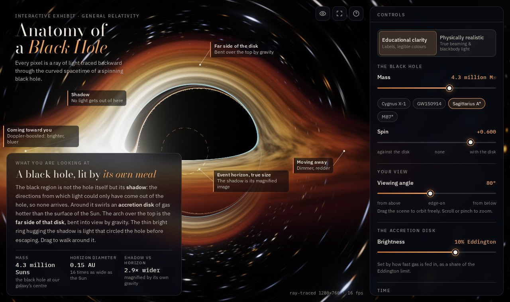
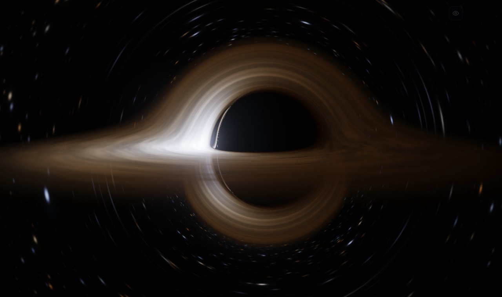
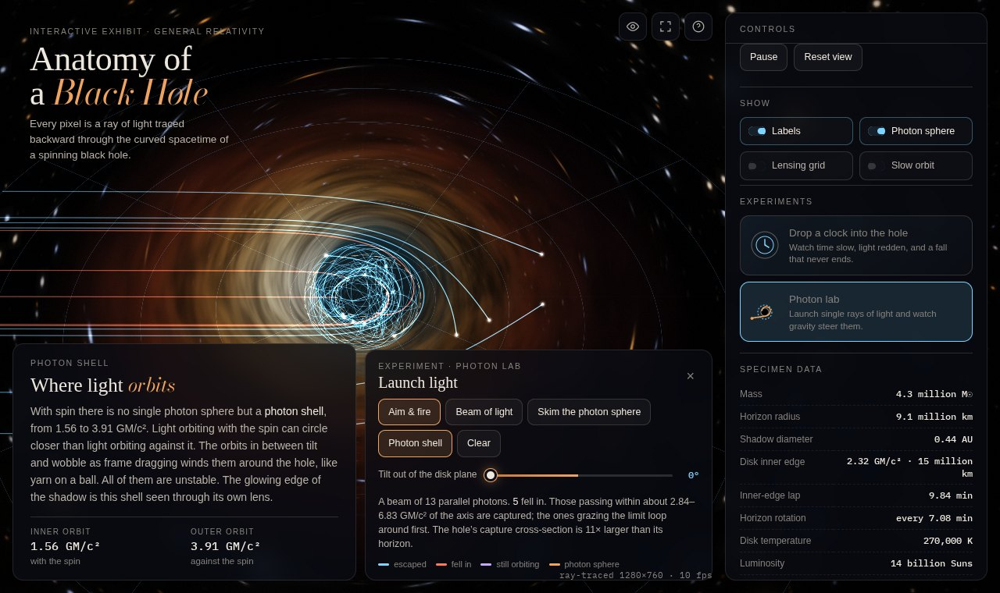

# Anatomy of a Black Hole

An interactive, ray-traced museum exhibit of a spinning (Kerr) black hole that runs in the browser.
Every pixel is a ray of light followed backwards through curved spacetime on the GPU, so the shadow,
the photon ring, the lensed far side of the disk and the lopsided Doppler glow all come out of the
calculation. None of them are painted on.



## Open it

- **Live:** <https://aherostrial.github.io/black-hole-opus-test/> (GitHub Pages, served from the `gh-pages` branch).
- **Double-click `dist/black-hole-exhibit.html`.** It is one self-contained file that works offline. The typefaces load from Google Fonts when you're online.
- Or serve the folder: `npm start`, then open <http://localhost:8080>.

You need a browser with WebGL 2 (current Chrome, Edge, Firefox or Safari). On a laptop GPU the renderer
drops its internal resolution until it holds a smooth frame rate. The current resolution and frame rate
are shown in the corner.

## What you can do

| Control | What changes, physically |
| --- | --- |
| **Mass** (3 M☉ → 30 billion M☉, with presets for Cygnus X-1, GW150914, Sagittarius A*, M87*) | The picture stays the same, because mass is the only ruler in general relativity. What changes is scale, time and heat: horizon size, orbital periods, disk temperature (hotter for smaller holes) and tidal forces (gentler for bigger holes). |
| **Spin** (−0.998 → +0.998) | Frame dragging. The inner edge of the disk moves between 1.24 and 9 GM/c², efficiency runs from 3.8% to 32%, and the shadow turns into a D-shape. |
| **Viewing angle** (or just drag) | Face-on, edge-on, or from below. Lensing lifts the far side of the disk over the top of the hole. |
| **Brightness** (feeding rate, 0.1–100% Eddington) | Luminosity rises in proportion. Temperature rises with the fourth root. |
| **Simulation speed** | Time runs in GM/c³ units. The explainer converts that to real seconds for the chosen mass. |
| **Educational clarity ↔ Physically realistic** | Educational: a warm legible palette, softened Doppler contrast, the ISCO marked and labelled. Realistic: full g⁴ relativistic beaming, gravitational redshift, blackbody colours, and exposure metered like a camera. |
| **Photon sphere / Lensing grid / Labels / Slow orbit** | Guides: true-size spherical photon orbits (the photon shell), a coordinate grid on the sky that lensing folds, and a slow camera orbit for demos. |

The placard at bottom left explains each change in plain English, using numbers computed for the
current settings.

### Experiments

- **Drop a clock into the hole.** A glowing clock is released from rest and falls freely, flashing once
  every 6 GM/c³ of its own time. The ray tracer shows each ray the light that left the clock at that
  ray's emission time. You watch the flashes spread out, redden and fade, and the clock stalls just outside
  the horizon forever, while its own clock reaches the horizon in minutes (for Sagittarius A*). Two clocks
  in the HUD show your time and the time you see on it.
- **Photon lab.** Drag on the orbital plane to aim a single photon and release to fire it. A live preview
  shows the path before you let go. Presets:
  - *Beam of light*: 13 parallel photons straddling the capture limit.
  - *Skim the photon sphere*: photons started 10⁻², 10⁻⁴, 10⁻⁶ and 10⁻⁸ outside the photon orbit. They lap it more times the closer they start, and the lab reports the instability growth factor it measured.
  - *Photon shell*: the woven spherical photon orbits of a spinning hole.

  The tilt slider launches photons out of the plane, so you can see frame dragging twist their orbits.

Keys: `Space` pause · `M` switch mode · `H` presenter mode (hides the interface for filming) ·
`F` full screen · `C` clock · `P` photon lab · `?` about.




## The physics

- **Light paths.** Null geodesics of the Kerr metric are integrated in Cartesian Kerr–Schild coordinates
  from the Hamiltonian H = ½ g^μν p_μ p_ν with an analytic gradient, using 4th-order Runge–Kutta with
  steps scaled to the distance travelled. The coordinates have no singularity at the horizon or on the
  spin axis. Rays are traced in the time-reversed spacetime, which is the outgoing chart of the real hole.
  Its time coordinate is exactly "when this light left its source", so light-travel delays come for free.
- **Camera.** A static observer. Pixel directions are built in the observer's own orthonormal frame, so
  aberration and the observer's blueshift are included.
- **Disk.** A thin disk with its inner edge at the ISCO and the Novikov–Thorne (Page–Thorne) flux profile.
  Each hit applies the redshift g = E_obs/E_emit, which combines the Doppler shift of Keplerian orbits,
  gravitational redshift and the camera factor. Realistic mode shows the blackbody colour at the shifted
  temperature gT with intensity ∝ (gT)⁴.
- **Clock.** A timelike geodesic from rest, resampled on the tracer's time coordinate, so each ray sees the
  clock at its own emission time.
- **Photon lab.** The same equations integrated forward in time, with photons launched in a
  zero-angular-momentum observer's frame.

Simplifications: the disk is infinitely thin and has no radiative transfer. There are no jets, no light
returning to the disk, and no polarisation. In realistic mode the hue is rescaled so the hottest gas looks
white; real disks are 10⁵–10⁷ K and would look blue-white to the eye.

## Updating the live site

GitHub Pages serves the `gh-pages` branch, which holds only `index.html`, `css/`, `js/` and `.nojekyll`.
After changing the exhibit, copy those onto that branch and push:

```
git worktree add ../pages gh-pages
cp -r index.html css js ../pages/ && cd ../pages
git add -A && git commit -m "Update site" && git push && cd - && git worktree remove ../pages
```

## Tests

```
npm test               # physics: 40 checks against closed-form results
npm run test:browser   # headless Chromium: renders, drives the UI, measures the shadow
npm run build          # regenerates dist/black-hole-exhibit.html
```

The physics suite checks the analytic Hamiltonian gradient against finite differences. It also checks the
capture thresholds (3√3 M for no spin, and both Kerr values), weak-field deflection 4M/b + 15πM²/4b²,
the photon-orbit instability (e^2π per orbit), the Page–Thorne closed form against direct integration,
and the free-fall proper time to the horizon and singularity. The browser check renders the black hole
and compares the shadow edge pixel by pixel with an independent CPU ray trace and with Synge's formula
(they agree to within half a pixel). It also exercises every control, the clock and the photon lab,
and checks the phone layout.

## Layout

```
index.html          markup and placards
css/exhibit.css     exhibit styling
js/physics.js       Kerr geometry, geodesics, disk model, free fall, units (also runs in Node)
js/shaders.js       GLSL: ray tracer, sky bake, bloom, composite, overlay ribbons
js/renderer.js      WebGL2 pipeline
js/app.js           state, frame loop, dynamic resolution
js/ui.js            controls, explainer placard, data table, shortcuts
js/explain.js       the plain-English explanations
js/labels.js        callouts anchored to the scene
js/lab.js           photon lab
js/probe.js         the falling clock
tools/build-single.mjs  one-file bundle
```
